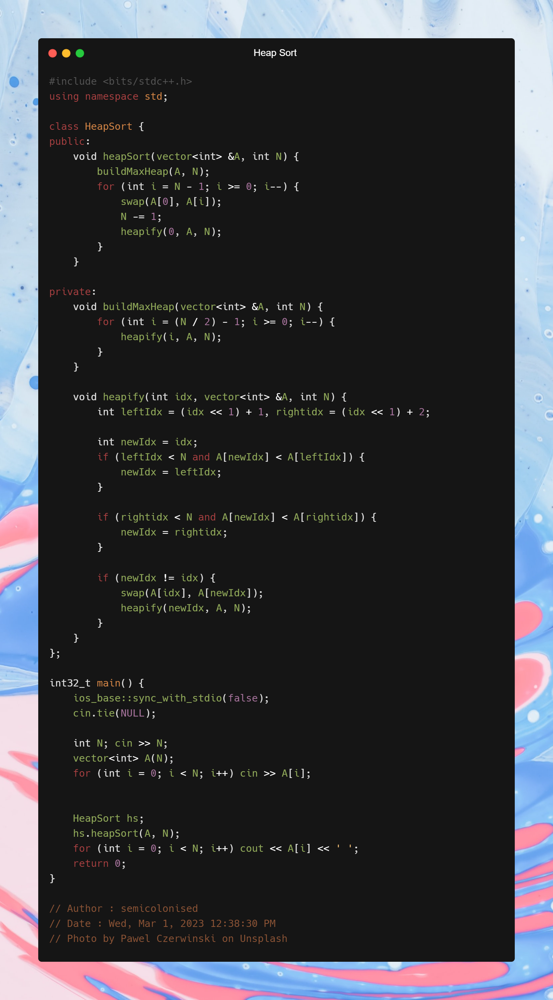

Build a max heap with the given array.  
This can be done by calling heapify() for all the leaf nodes. 
The leaf nodes are from A[(n / 2)] to A[n - 1] (0-indexed) or A[(n / 2) + 1] to A[n] (1-indexed). 
Next, for every element from N - 1 to 0, heapify and swap the 1st element with the ith element (where i is N - 1 to 0). 
Decrease N by 1 in each step. 

Clean Code

